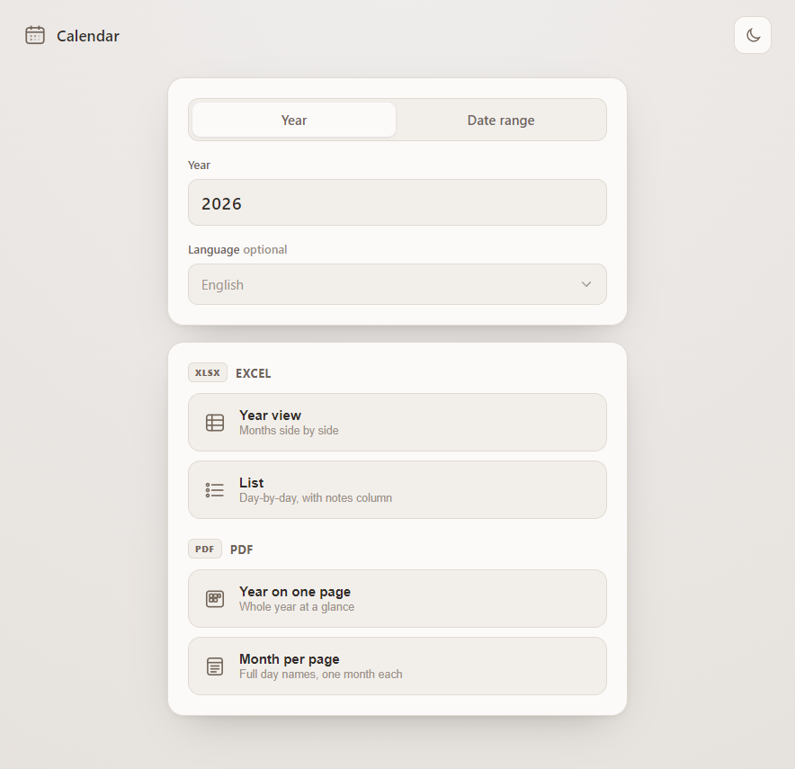
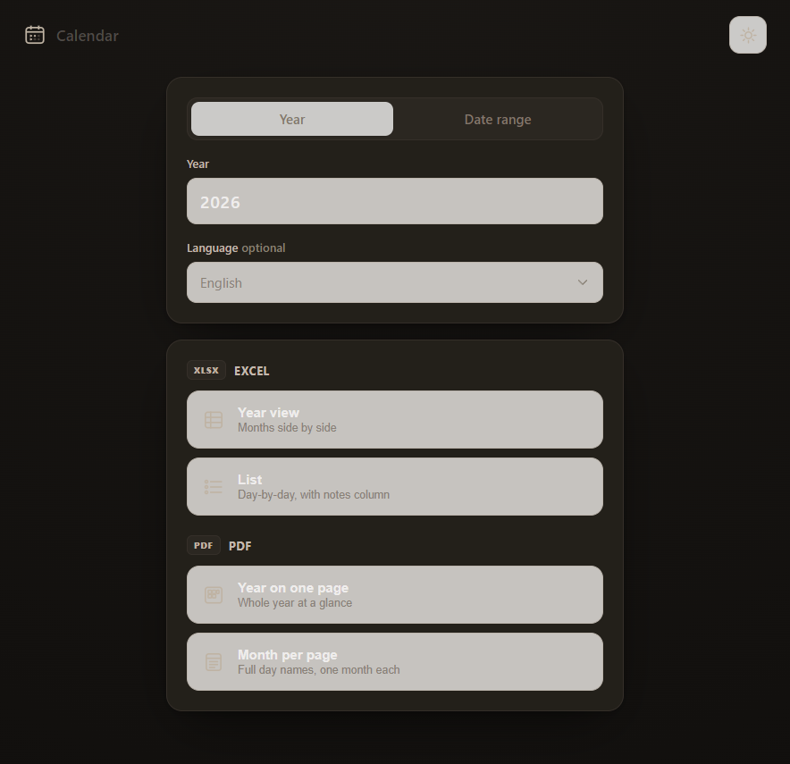

# Calendar

A clean, minimal **Windows app** that turns **any year** — or **any date range** — into elegant,
ready-to-use **Excel** and **PDF** calendars, in **any language**.

<p align="center">
  
  
</p>

## Install (Windows 10/11)

1. Download **`Calendar Setup x.y.z.exe`** from the **[latest release](../../releases/latest)**.
2. Run it — it installs per-user (no admin prompt) and adds Start-menu and desktop shortcuts.
3. Launch **Calendar**.

> The app isn't code-signed, so Windows SmartScreen may show *“Windows protected your PC.”*
> Click **More info → Run anyway**. (This is normal for independent apps.)

## Features

**Input**
- **Year** — type any year (extra spaces are trimmed; no upper limit).
- **Date range** — a built-in date picker: tap the month title to jump by month, the side arrows
  move by year, *To* opens on the *From* month, and **Clear dates** resets the range.
- **Language** *(optional)* — a searchable dropdown of the six UN official languages plus
  ~110 world languages. Type to filter, press **Enter** to select. Defaults to English.

Month and day names are rendered in the selected language (via the system's Unicode/ICU data),
including right-to-left scripts (Arabic) and CJK (Chinese).

**Output** — one click per option, saved straight to your **Downloads** folder:

| Button | File | Description |
| --- | --- | --- |
| Year view | `.xlsx` | Months side by side; weekend numbers shaded soft grey. |
| List | `.xlsx` | A month-by-month list with a wide notes column; weekends shaded. |
| Year on one page | `.pdf` | The whole year on a single landscape page, first-letter day names. |
| Month per page | `.pdf` | One month per page with day names fully spelled out. |

When a date range is used, every output keeps the same structure but is limited to the selected
dates (partial months show only the days in range, aligned to the top).

**Appearance** — a sun/moon button toggles light (cream) and dark (near-black) themes, built from
the palette `#EFEDEC · #D0CAC3 · #AD9E90 · #746558 · #322D29`.

## Build from source

Requires [Node.js](https://nodejs.org) 18+.

```bash
git clone https://github.com/Liah-Brussolo/<repo>.git
cd <repo>
npm install
npm start          # run the app
npm run dist       # build the Windows installer into dist/
```

Handy dev scripts:

```bash
npm run smoke      # generate sample Excel + PDF outputs to _smoke/
npm run e2e        # drive the real renderer + IPC bridge and verify every output
```

## Releasing (maintainer)

The installer is **not** committed to the repo — it's published to GitHub Releases. Pushing a
version tag triggers the [release workflow](.github/workflows/release.yml), which builds the
installer on a Windows runner and attaches it to the release automatically:

```bash
npm version patch        # bumps package.json and creates a tag (e.g. v1.0.1)
git push --follow-tags
```

Or manually: build with `npm run dist` and upload `dist/Calendar Setup x.y.z.exe` to a new release.

## How it works

- **Localization** uses the platform's `Intl` data, so month/day names are correct for every
  locale without bundled translation tables.
- **PDFs** are rendered by Chromium (`webContents.printToPDF`), which shapes every script —
  Latin, Cyrillic, Greek, Arabic (RTL), CJK — using Windows system fonts.
- **Excel** is written with [ExcelJS](https://github.com/exceljs/exceljs); weekends (Sat/Sun) are
  shaded in the spreadsheet. PDF calendars start the week on Sunday.

## Project structure

```
core/          Pure, framework-free logic (date math, i18n, Excel, PDF HTML)
electron/      Main process, secure preload bridge, generation + PDF rendering
src/           Renderer UI (HTML / CSS / JS) + the custom date picker
build/         Icon generator and dev/test harnesses
.github/       Release workflow
```

## License

[MIT](LICENSE) © Liah Brussolo
